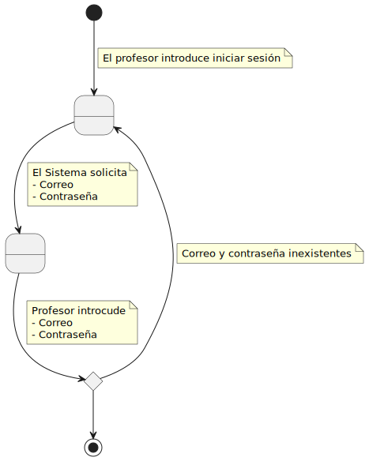
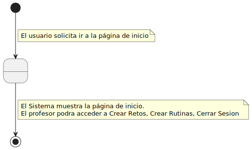
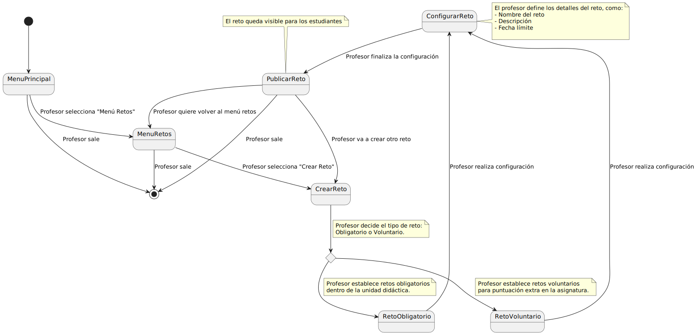
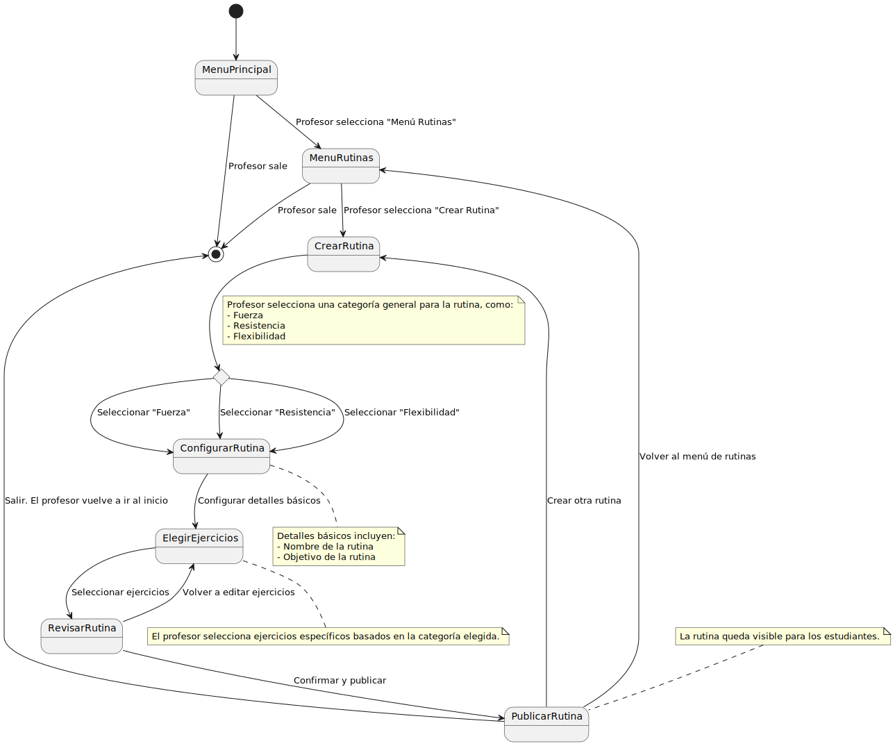
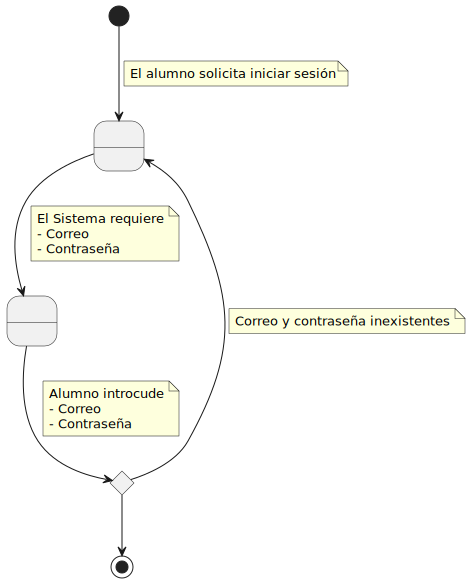
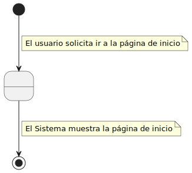
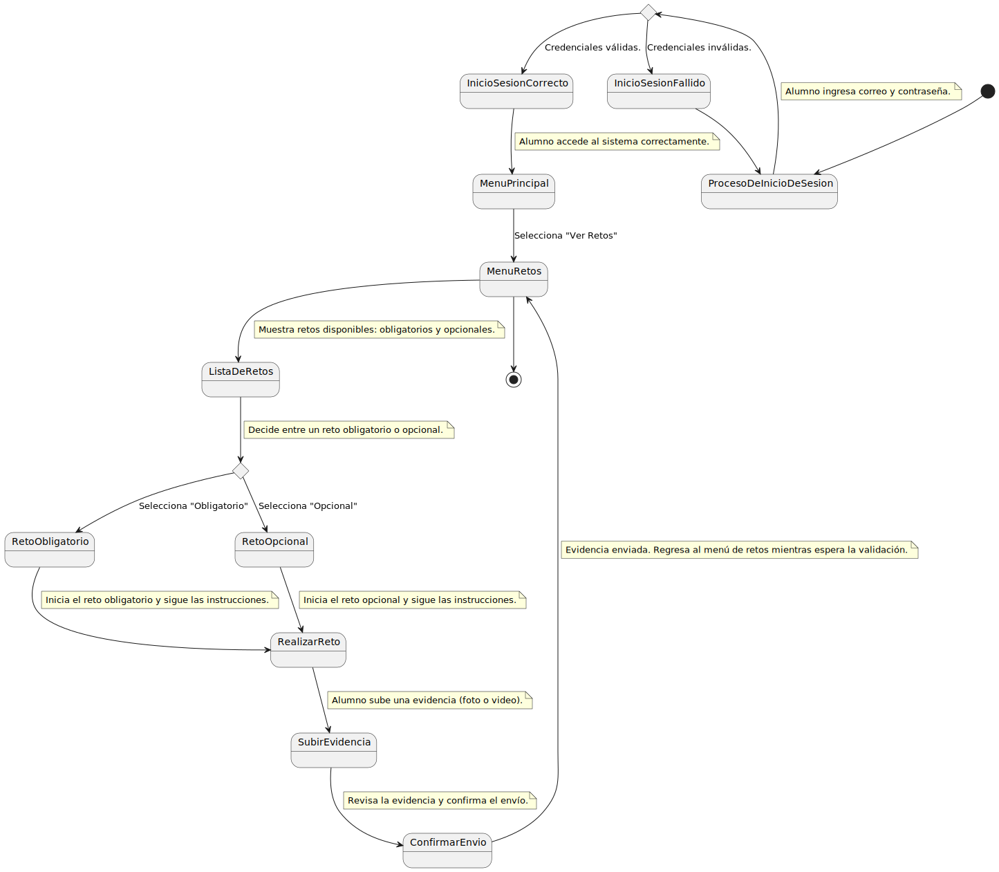

# Detallar Casos De Uso

## Usuario No Registrado
### Registrarse 
| Diagrama | Código Fuente |
|----------|---------------|
|  | [Ver código](Registrarse.puml) |

## Profesor
### Iniciar Sesión 
| Diagrama | Código Fuente |
|----------|---------------|
|  | [Ver código](IniciarSesionProfesor.puml) |

### Ir Al Inicio 
| Diagrama | Código Fuente |
|----------|---------------|
|  | [Ver código](IniciarSesionProfesor.puml) |

### Crear Retos 
| Diagrama | Código Fuente |
|----------|---------------|
|  | [Ver código](CrearRetos.puml) |

### Crear Rutinas 
| Diagrama | Código Fuente |
|----------|---------------|
|  | [Ver código](CrearRutinas.puml) |

### Cerrar Sesión 
| Diagrama | Código Fuente |
|----------|---------------|
|  | [Ver código](CerrarSesion.puml) |

## Alumno
### Iniciar Sesión 
| Diagrama | Código Fuente |
|----------|---------------|
|  | [Ver código](IniciarSesionAlumno.puml) |

### Ir Al Inicio 
| Diagrama | Código Fuente |
|----------|---------------|
|  | [Ver código](IrAlInicio.puml) |

### Completar Retos 
| Diagrama | Código Fuente |
|----------|---------------|
|  | [Ver código](CompletarRetos.puml) |

### Completar Rutinas 
| Diagrama | Código Fuente |
|----------|---------------|
|  | [Ver código](CompletarRutinas.puml) |

### Cerrar Sesión 
| Diagrama | Código Fuente |
|----------|---------------|
|  | [Ver código](CerrarSesion.puml) |

