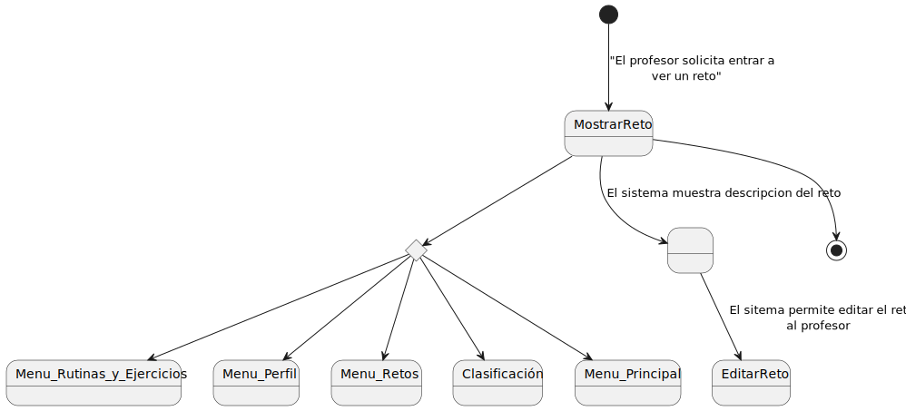

      

# Detallar Casos De Uso

## Usuario No Registrado
### Registrar 
| Diagrama | Código Fuente |
|----------|---------------|
|  | [Ver código](Registrarse.puml) |

## Profesor

### Cambiar a Rutinas y Ejercicios
| Diagrama | Código Fuente |
|----------|---------------|
|  | [Ver código](Profesor/CambiarAClasificacion.puml) |

### Cambiar a Perfil
| Diagrama | Código Fuente |
|----------|---------------|
|  | [Ver código](Profesor/CambiarAPerfil.puml) |

### Cambiar a Retos
| Diagrama | Código Fuente |
|----------|---------------|
|  | [Ver código](Profesor/CambiarARetos.puml) |

### Cambiar a Rutinas y Ejercicios
| Diagrama | Código Fuente |
|----------|---------------|
|  | [Ver código](Profesor/EditarRutina.puml) |

### Crear Clase
| Diagrama | Código Fuente |
|----------|---------------|
|  | [Ver código](Profesor/CrearClase.puml) |

### Crear Ejercicio
| Diagrama | Código Fuente |
|----------|---------------|
|  | [Ver código](Profesor/CrearEjercicio.puml) |

### Crear Retos
| Diagrama | Código Fuente |
|----------|---------------|
|  | [Ver código](Profesor/EditarEjercicio.puml) |

### Crear Rutina
| Diagrama | Código Fuente |
|----------|---------------|
|  | [Ver código](Profesor/CrearRutina.puml) |

### Mostrar Reto
| Diagrama | Código Fuente |
|----------|---------------|
|  | [Ver código](Profesor/MostrarReto.puml) |

### Crear Retos 
| Diagrama | Código Fuente |
|----------|---------------|
|  | [Ver código](Profesor/CrearRetos.puml) |

### Editar Reto
| Diagrama | Código Fuente |
|----------|---------------|
|  | [Ver código](Profesor/EditarReto.puml) |

### Cambiar a Clasificación
| Diagrama | Código Fuente |
|----------|---------------|
|  | [Ver código](Profesor/CambiarAClasificacion.puml) |

### Evaluar Retos
| Diagrama | Código Fuente |
|----------|---------------|
|  | [Ver código](Profesor/Evaluar_Retos.puml) |

### Cambiar a Perfil
| Diagrama | Código Fuente |
|----------|---------------|
|  | [Ver código](Profesor/CambiarAPerfil.puml) |

### Crear Clase
| Diagrama | Código Fuente |
|----------|---------------|
|  | [Ver código](Profesor/CrearClase.puml) |

### Mostrar QR
| Diagrama | Código Fuente |
|----------|---------------|
|  | [Ver código](Profesor/Mostrar_QR.puml) |

### Mostrar Reto
| Diagrama | Código Fuente |
|----------|---------------|
|  | [Ver código](Profesor/MostrarReto.puml) |

### Mostrar Rutina
| Diagrama | Código Fuente |
|----------|---------------|
|  | [Ver código](Profesor/MostrarRutina.puml) |

### Ver Alumnos
| Diagrama | Código Fuente |
|----------|---------------|
|  | [Ver código](Profesor/Ver_Alumnos.puml) |

### Ver Clasificación de una clase
| Diagrama | Código Fuente |
|----------|---------------|
|  | [Ver código](Profesor/Ver_Alumnos_Clase.puml) |

### Ver Mis Clases
| Diagrama | Código Fuente |
|----------|---------------|
|  | [Ver código](Profesor/Ver_Mis_Clases.puml) |

### Ver Retos Alumnos
| Diagrama | Código Fuente |
|----------|---------------|
|  | [Ver código](Profesor/Ver_Retos_Alumnos.puml) |

## Alumno

### Cambiar a Clasificación
| Diagrama | Código Fuente |
|----------|---------------|
|  | [Ver código](Alumno/MenuClasificacion.puml) |

### Cambiar a Perfil
| Diagrama | Código Fuente |
|----------|---------------|
|  | [Ver código](Alumno/MenuPerfilAlumno.puml) |

### Cambiar a Retos
| Diagrama | Código Fuente |
|----------|---------------|
|  | [Ver código](Alumno/MenuRetos.puml) |

### Ver Rutinas y Ejercicios
| Diagrama | Código Fuente |
|----------|---------------|
|  | [Ver código](Alumno/Menu_Rutinas_Alumno.puml) |

### Crear Rutina
| Diagrama | Código Fuente |
|----------|---------------|
|  | [Ver código](Alumno/CrearRutina.puml) |

### Editar Rutina
| Diagrama | Código Fuente |
|----------|---------------|
|  | [Ver código](Alumno/EditarRutina.puml) |

### Mostrar Ejercicio
| Diagrama | Código Fuente |
|----------|---------------|
|  | [Ver código](Alumno/MostrarEjercicio.puml) |

### Buscar Ejercicio
| Diagrama | Código Fuente |
|----------|---------------|
|  | [Ver código](Alumno/BuscarEjercicio.puml) |

### Mostrar QR
| Diagrama | Código Fuente |
|----------|---------------|
|  | [Ver código](Alumno/MostrarQR.puml) |

### Ver Reto
| Diagrama | Código Fuente |
|----------|---------------|
|  | [Ver código](Alumno/MostrarReto.puml) |

### Mostrar Rutina
| Diagrama | Código Fuente |
|----------|---------------|
|  | [Ver código](Alumno/MostrarRutina.puml) |

### Subir Evidencia
| Diagrama | Código Fuente |
|----------|---------------|
|  | [Ver código](Alumno/SubirEvidencia.puml) |

### Cambiar a Clasificación
| Diagrama | Código Fuente |
|----------|---------------|
|  | [Ver código](Alumno/MenuClasificacion.puml) |

### Cambiar a Perfil
| Diagrama | Código Fuente |
|----------|---------------|
|  | [Ver código](Alumno/MenuPerfilAlumno.puml) |

### Inscribir Clase
| Diagrama | Código Fuente |
|----------|---------------|
|  | [Ver código](Alumno/InscribirClase.puml) |

### Ver Insginias
| Diagrama | Código Fuente |
|----------|---------------|
|  | [Ver código](Alumno/VerInsignias.puml) |

## Profesor y Alumno 

### Iniciar Sesión 
| Diagrama | Código Fuente |
|----------|---------------|
|  | [Ver código](IniciarSesion.puml) |

### Ingresar Al Sistema
| Diagrama | Código Fuente |
|----------|---------------|
|  | [Ver código](Profesor/IngresarAlSistema.puml) |

### Cerrar Sesión 
| Diagrama | Código Fuente |
|----------|---------------|
|  | [Ver código](CerrarSesion.puml) |