

      

# Diagrama de Contexto

## Diagrama de Contexto del Usuario No Registrado

[Ver código](UsuarioNoRegistradoContexto.puml)

---

## Diagrama de Contexto del Administrador

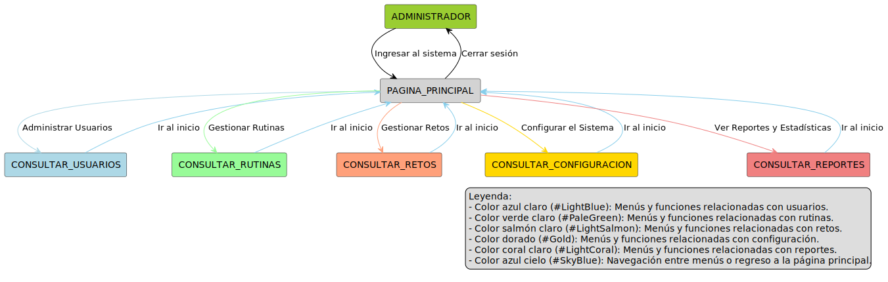

[Ver código](DiagramasDeContextoAdministrador/AdministradorContexto.puml)

### Diagrama de Contexto Consultar Usuarios

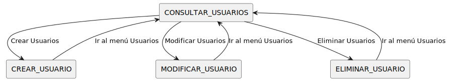

[Ver código](DiagramasDeContextoAdministrador/DiagramaDeContextoConsultarUsuariosAdministrador.puml)

### Diagrama de Contexto Consultar Rutinas

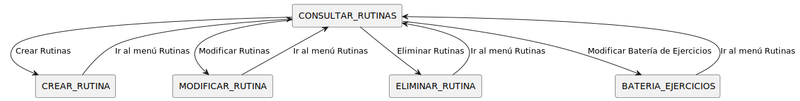

[Ver código](DiagramasDeContextoAdministrador/DiagramaDeContextoConsultarRutinasAdministrador.puml)

### Diagrama de Contexto Consultar Retos

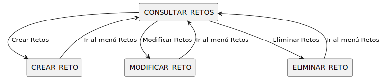

[Ver código](DiagramasDeContextoAdministrador/DiagramaDeContextoConsultarRetosAdministrador.puml)

### Diagrama de Contexto Consultar Configuracion

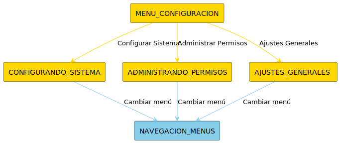

[Ver código](DiagramasDeContextoAdministrador/DiagramaDeContextoConsultarConfiguracionAdministrador.puml)

### Diagrama de Contexto Consultar Reportes

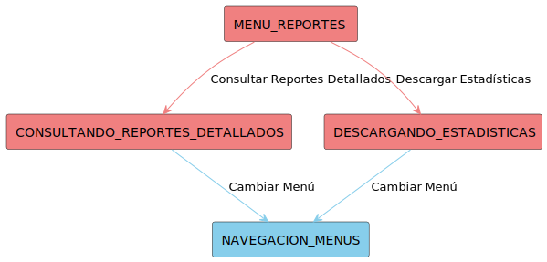

[Ver código](DiagramasDeContextoAdministrador/DiagramaDeContextoConsultarReportesAdministrador.puml)

---

## Diagrama de Contexto del Alumno

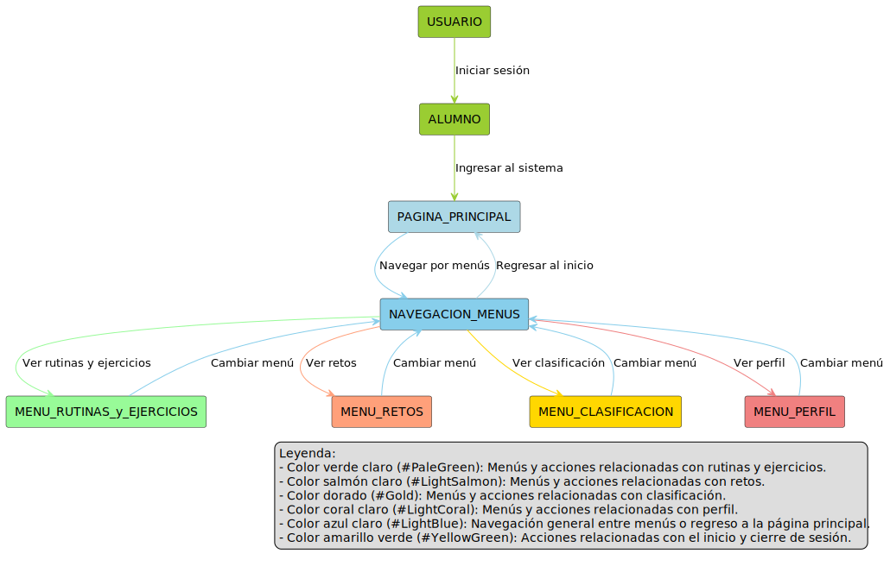

[Ver código](DiagramasDeContextoAlumnos/AlumnosContexto.puml)

### Diagrama de Contexto Menu Rutinas y Ejercicios

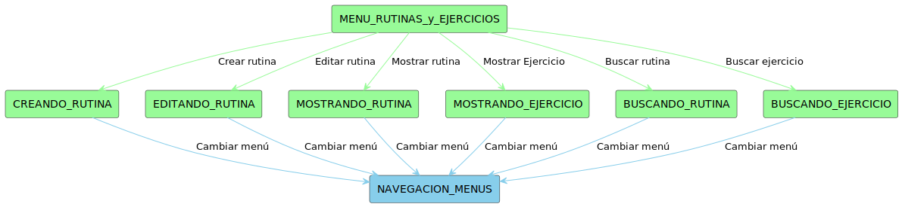

[Ver código](DiagramasDeContextoAlumnos/DiagramaDeContextoMenuRutinasyEjerciciosAlumno.puml)

### Diagrama de Contexto Menu Retos

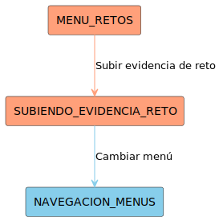

[Ver código](DiagramasDeContextoAlumnos/DiagramDeContextoMenuRetosAlumno.puml)

### Diagrama de Contexto Menu Perfil

[Ver código](DiagramasDeContextoAlumnos/DiagramaDeContextoMenuPerfilAlumnos.puml)

---

## Diagrama de Contexto del Profesor

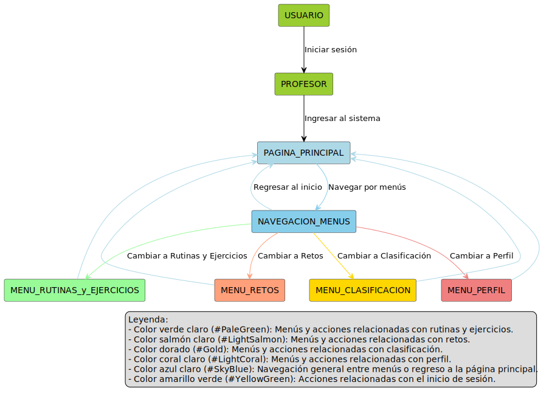

[Ver código](DiagramaDeContextoProfesor/ProfesorContexto.puml)

### Diagrama de Contexto Menu Rutinas y Ejercicios

[Ver código](DiagramaDeContextoProfesor/DiagramaDeContextoMenuRutinasyEjerciciosProfesor.puml)

### Diagrama de Contexto Menu Retos

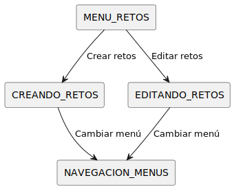

[Ver código](DiagramaDeContextoProfesor/DiagramaDeContextoMenuRetosProfesor.puml)

### Diagrama de Contexto Menu Perfil

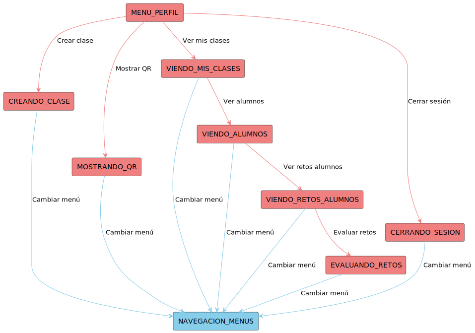

[Ver código](DiagramaDeContextoProfesor/DiagramaDeContextoMenuPerfilProfesor.puml)

### Diagrama de Contexto Menu Clasificacion

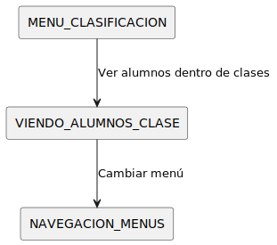

[Ver código](DiagramaDeContextoProfesor/DiagramaDeContextoMenuClasificacionProfesor.puml)