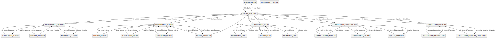

# Diagrama de Contexto

## Diagrama de Contexto del Usuario No Registrado

[Ver código](UsuarioNoRegistradoContexto.puml)

---

## Diagrama de Contexto del Administrador

[Ver código](AdministradorContexto.puml)

---

## Diagrama de Contexto del Alumno

[Ver código](AlumnosContexto.puml)

---

## Diagrama de Contexto del Profesor

[Ver código](ProfesorContexto.puml)
