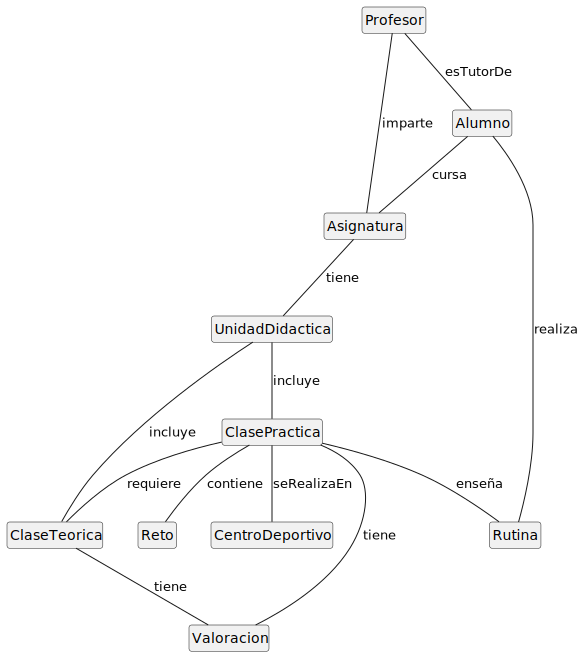
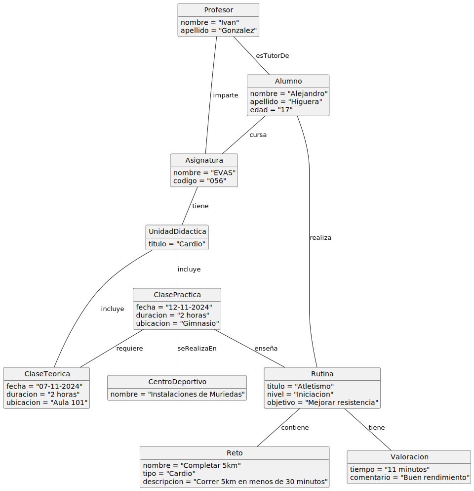
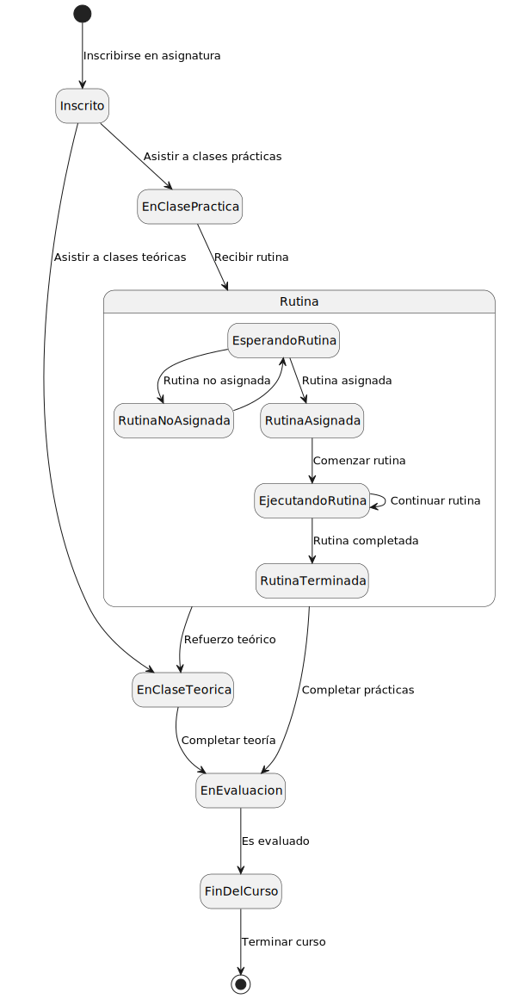
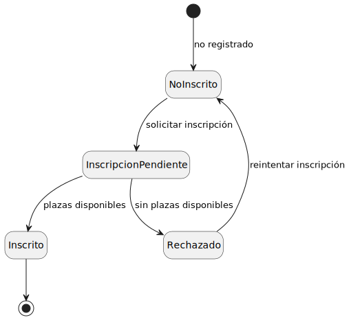
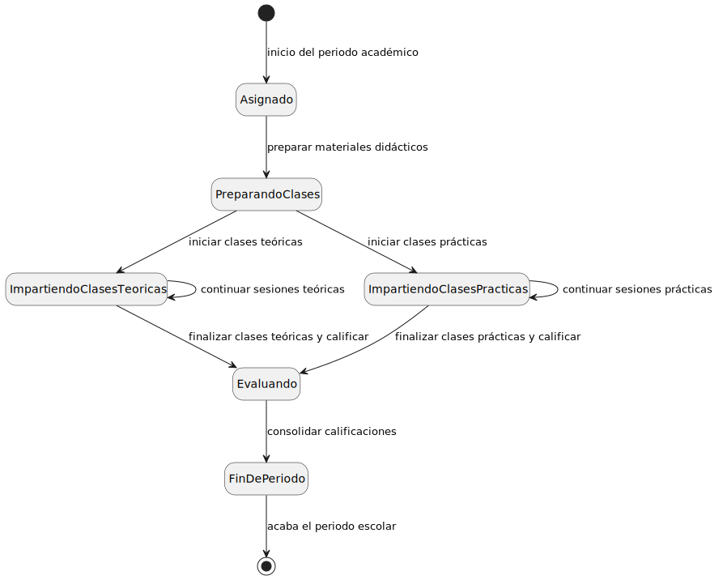

# Modelo de Dominio

         

## Diagrama de Clases 
| Diagrama | Código Fuente |
|----------|---------------|
| | [Ver código](../Documentos/ModelosUML/evas.puml) |

## Diagrama de Objetos 
| Diagrama | Código Fuente |
|----------|---------------|
| | [Ver código](../Documentos/diagramaDeObjetos/diagramaDeObjetos.puml) |

## Diagrama de Estados 

### Ciclo de Vida del Alumno
| Diagrama | Código Fuente |
|----------|---------------|
| | [Ver código](../Documentos/diagramaDeEstados/Alumnos/CicloDeVidaAlumno.puml) |

### Proceso de inscripción Alumno
| Diagrama | Código Fuente |
|----------|---------------|
| | [Ver código](../Documentos/diagramaDeEstados/Alumnos/ProcesoDeInscripcionAlumno.puml) |

### Ciclo de Vida del Profesor
| Diagrama | Código Fuente |
|----------|---------------|
| | [Ver código](../Documentos/diagramaDeEstados/Profesor/cicloDeVidaProfesor.puml) |

