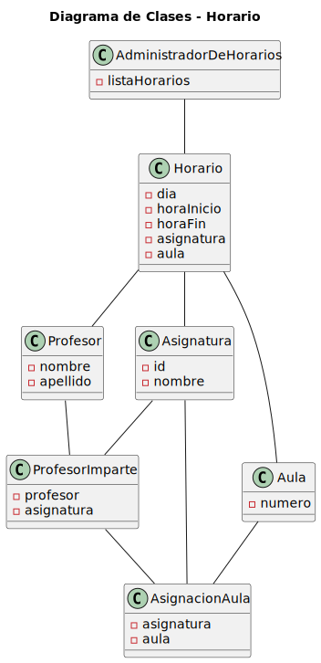
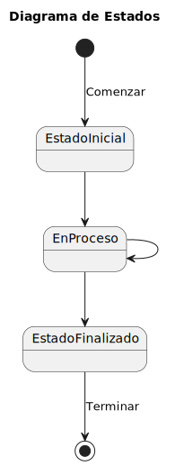
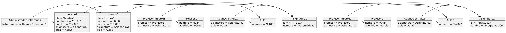

# Gestión de Horarios - Sistema Integral de Gestión de Horarios Universitarios 🗓️

#  Gestión de Horarios Universitarios 🗓️

**Gestión de Horarios** es una herramienta integral diseñada para optimizar la planificación y asignación de horarios en universidades. Este sistema facilita la organización de asignaturas, profesores, estudiantes y aulas, garantizando una gestión eficiente y centralizada.  

Con una **interfaz intuitiva** y un **calendario interactivo**, la solución mejora la experiencia del usuario y asegura un uso óptimo de los recursos académicos disponibles.

---

## 🚀 **Características principales**
- 📅 Planificación centralizada de horarios.
- 👩‍🏫 Gestión de profesores, asignatura, estudiantes y aulas.
- 🖥️ Interfaz de usuario intuitiva con visualización de calendarios interactivos.

---

## 🛠️ **Modelo de Dominio**
El sistema se basa en un modelo conceptual sólido que facilita la escalabilidad y el mantenimiento:

### 📌 **Diagramas clave**:
1. **Diagrama de Clases**  
   Representa las relaciones y dependencias entre las entidades principales, como Asignaturas, Profesores y Aulas.
   
   

2. **Diagrama de Estados**  
   Muestra los estados posibles de las entidades y las transiciones entre ellos.

   

3. **Diagrama de Objetos**  
   Representa ejemplos específicos de las entidades en acción.

   

---

## 👥 **Miembros del proyecto**
- **Sergio Moreno Vega**
- **Iker Celaya Buezo**
- **Adrián Garcia Arranz**
- **Joaquin Rodriguez Figueroa**
