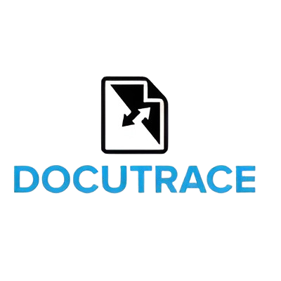

|     |
|-:|

  

## 🔰 Descripción General

*DOCUTRACE* es una aplicación en línea diseñada para la gestión documental dentro de una universidad. Su objetivo principal es permitir a los administradores y trabajadores gestionar y acceder a documentos de manera segura y trazable. La aplicación facilita el envío, recepción y firma electrónica de documentos, asegurando la integridad y validez legal de los mismos.

## 🔰 Modelo de Dominio

El [modelo de dominio](docs/modeloDeDominio/README.md) de *DOCUTRACE* define las entidades principales y sus relaciones dentro del sistema.

Para describir el modelo del dominio se utilizan los siguientes artefactos:

- [Diagrama de Clases](docs/modeloDeDominio/diagramaDeClases)
- [Diagrama de Objetos](docs/modeloDeDominio/diagramaDeObjetos)
- [Diagrama de Estados](docs/modeloDeDominio/diagramaDeEstados)

## 🔰 Actores y Casos de Uso

En esta sección se describen los actores principales que interactúan con el sistema y los casos de uso que representan las funcionalidades clave del proyecto.

Se pueden ver más detalles sobre esto con las siguientes herramientas:

- [Actores](docs/casosDeUso/actores/README.md)
- [Diagrama de Contexto](docs/casosDeUso/diagramaDeContexto/README.md)
- [Diagrama de Casos de Uso](docs/casosDeUso/diagramaCasosDeUso/README.md)
- [Detallado de Casos de Uso](docs/casosDeUso/detalladoCasosDeUso/README.md)
- [Prototipos](docs/casosDeUso/detalladoCasosDeUso/README.md)

## 🔰 Sesiones de Requisitado

| Sesión | Fecha | Miembros presentes | Temas Tratados | Observaciones |
|--------|-------|--------------------|----------------|---------------|
| 1      | [16-10-2024](docs/sesiones/16-10-2024/apuntesSesion.md)  | Diego Moys, Diego Jiménez, José Luis Rodriguez, Santiago Gómez | Introducción al proyecto, definición de objetivos.  | Se trataron generalidades del proyecto y dudas iniciales sobre el alcance y funcionalidad del proyecto.             |
| 2      | [29-10-2024](docs/sesiones/29-10-2024/apuntesSesion.md)  | Diego Moys, Diego Jiménez, Santiago Gómez | Dudas generadas sobre la primera iteración de los avances.  | Se resolvieron las dudas generadas al momento de diagramar. La interesada también accedió a utilizar las Discussions de GitHub para mantener una comunicación fluida. |             |

## 🔰 Recursos Adicionales

[Aquí](docs/recursos/) podrás encontrar imágenes, documentos PDF y otros materiales que complementan la información presentada y proporcionan un entendimiento más profundo del proyecto.
