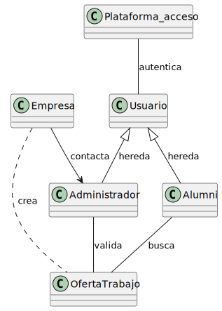

# Sesiones de requisitado

Este es el repositorio de las sesiones de requisitado de la asignatura de Ingeniería del Software I de UNEATLANTICO.

Se desarrolla, en un caso real, la disciplina de requisitado, que es la puerta de entrada al desarrollo de una solución basada en software. 

## Modelo del Dominio:

## Diagrama de Clases:

## Diagrama de Objetos:

## Diagrama de Estados:

