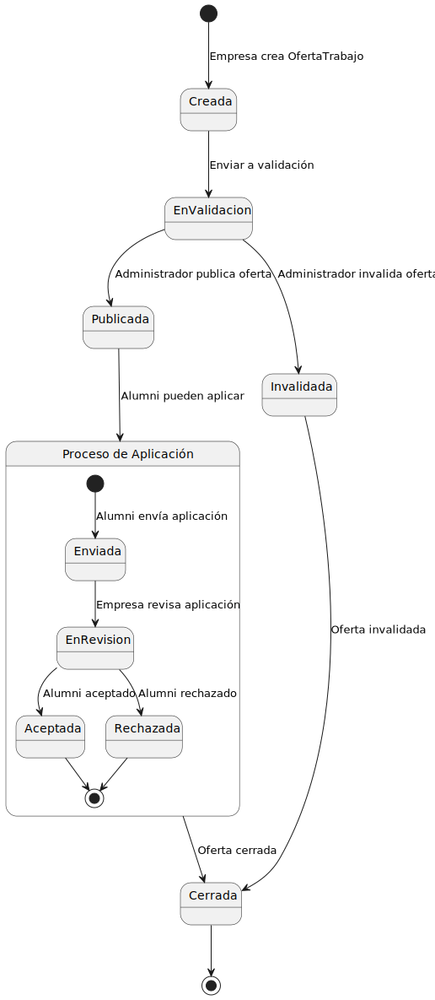

# Alumni 
## 🎓 Sistema de gestion de ofertas de trabajo
El Sistema Alumni es una plataforma que conecta a antiguos alumnos de la universidad con oportunidades laborales ofrecidas por empresas asociadas. Facilita la búsqueda de empleo para los egresados y permite a las empresas acceder a talentos cualificados de la universidad.

---
## Características principales

- **Acceso a ofertas de empleo**: Los antiguos alumnos pueden explorar y postularse a las ofertas publicadas por empresas asociadas.
- **Publicación de ofertas por empresas**: Las empresas tienen la capacidad de crear y gestionar sus ofertas de trabajo.
- **Validación de ofertas**: El sistema incluye un proceso de aprobación por parte de un administrador para garantizar la calidad de las ofertas.
---

## 🧩 Modelo del Dominio:

### Diagrama de Clases:

### Diagrama de Objetos:

### Diagrama de Estados:

## 📊 Casos de Uso

- [Actores y casos de uso](/modelosUML/CasosDeUso/ActoresYCasos.md#actores)
- [Priorizacion](/modelosUML/CasosDeUso/ActoresYCasos.md#2-priorizar-casos-de-uso)
- [Detallar casos de uso](/modelosUML/CasosDeUso/ActoresYCasos.md#3-detallar-casos-de-uso)
- [Prototipado](/modelosUML/CasosDeUso/Fotos/Fotos%20Prototipado/)
- [Diagramas de Contexto](/modelosUML/CasosDeUso/ActoresYCasos.md#diagramas-de-contexto)

---

## 📅 Sesiones

- [10/16](sesiones/1016.md)

- [11/13](sesiones/1113.md)
---

## 👨‍💻 Equipo de Desarrollo

- Anibal Bayas
- Pablo Cantero
- César García
- Neco Martínez
- Javier Salmerón

