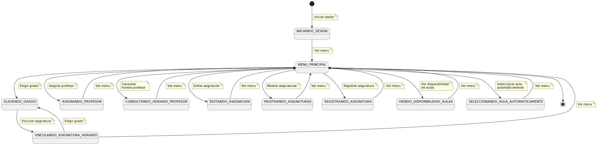
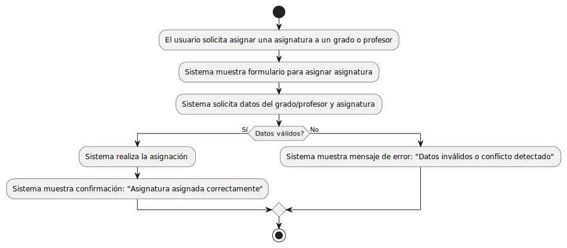
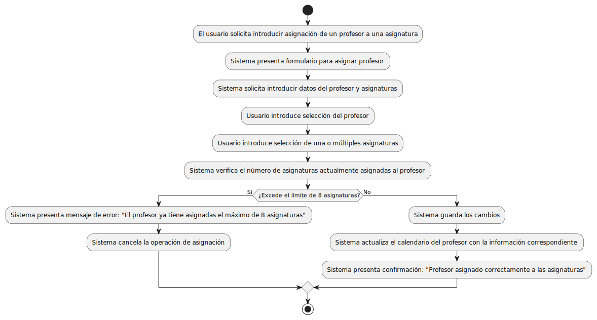
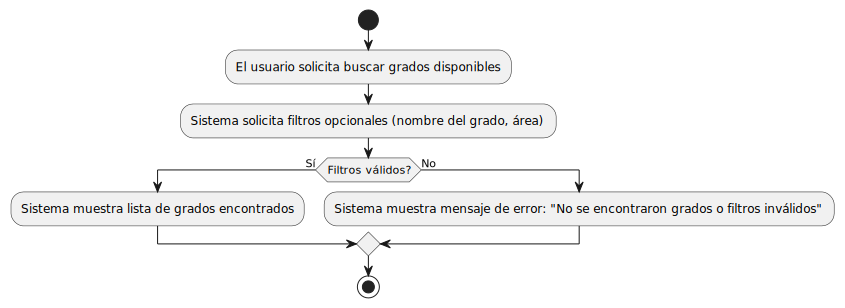
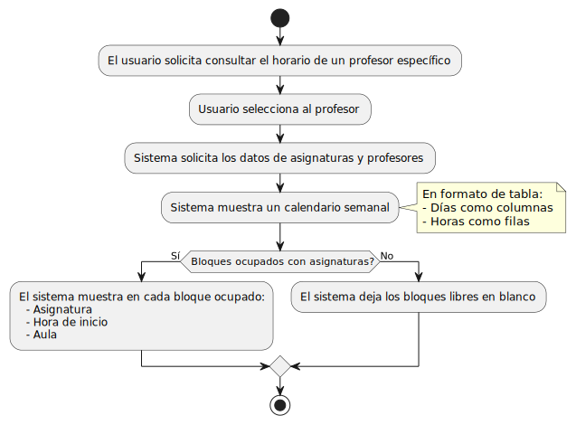
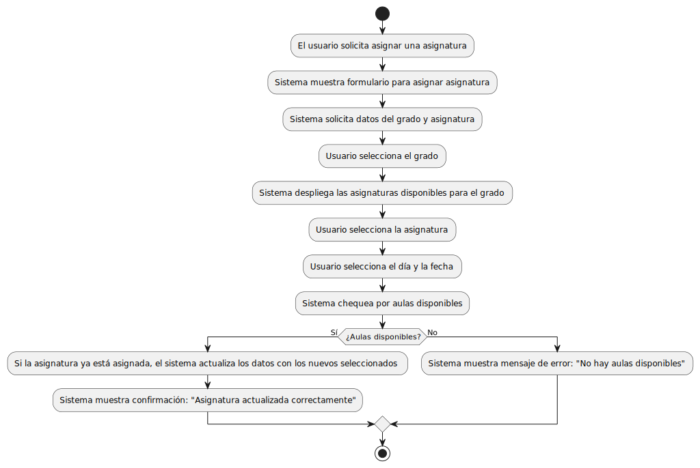
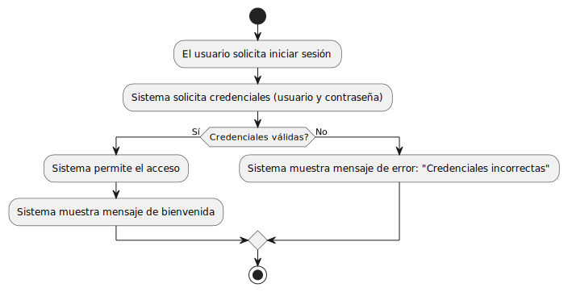
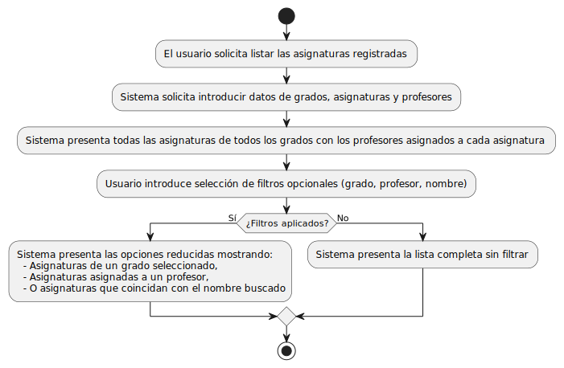
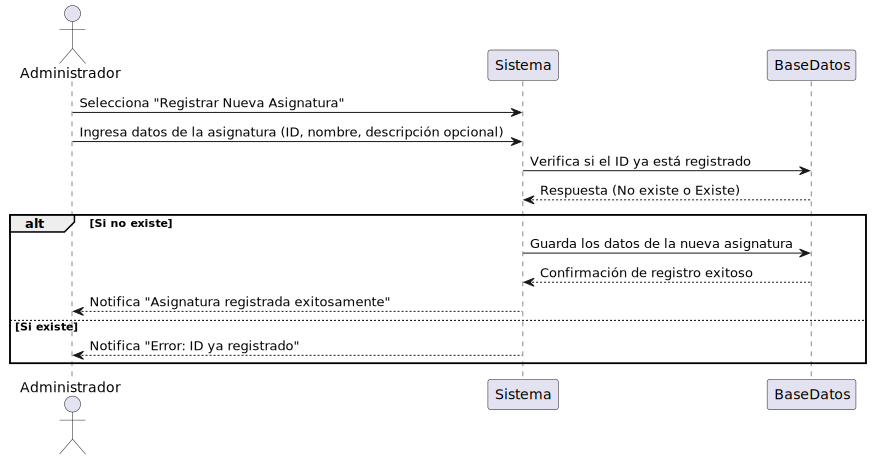
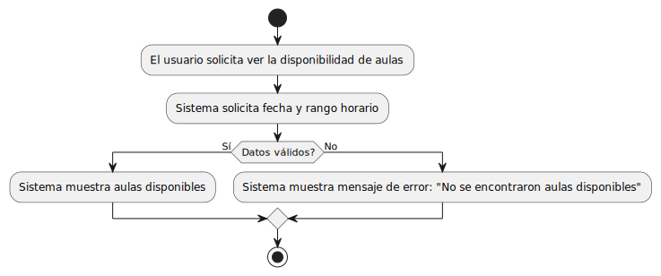

# Diagrama de Contexto

## Casos de Uso

1. **[Asignar Asignatura](../imagenes/AsignarAsignatura.svg)**
   - 
   - Asignar una asignatura a un grado o profesor.

2. **[Asignar Profesor](../imagenes/AsignarProfesor.svg)**
   - 
   - Asignar un profesor a una asignatura.

3. **[Buscar Grado](../imagenes/BuscarGrado.svg)**
   - 
   - Buscar grados disponibles en el sistema.

4. **[Consultar Horario Profesor](../imagenes/ConsultarHorarioProfesor.svg)**
   - 
   - Consultar el horario de un profesor específico.

5. **[Editar Asignación](../imagenes/EditarAsignacion.svg)**
   - 
   - Editar asignaciones de profesores y asignaturas.

6. **[Inicio de Sesión](../imagenes/InicioSesion.svg)**
   - 
   - Inicio de sesión del administrador.

7. **[Mostrar Asignaturas](../imagenes/MostrarAsignaturas.svg)**
   - 
   - Visualizar las asignaturas registradas.

8. **[Registrar Asignatura](../imagenes/RegistrarAsignatura.svg)**
   - 
   - Registrar una nueva asignatura en el sistema.

9. **[Ver Disponibilidad Aulas](../imagenes/VerDisponibilidadAulas.svg)**
   - 
   - Ver la disponibilidad de las aulas.

