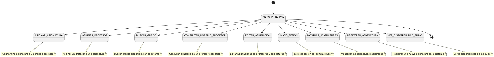

# Diagrama de Contexto

<map name="contexto-map">
  <area shape="rect" coords="181,188,384,259" href="./imagenes/AsignarAsignatura.png" alt="Asignar Asignatura" title="Asignar Asignatura">
  <area shape="rect" coords="400,185,600,261" href="./imagenes/AsignarProfesor.png" alt="Asignar Profesor" title="Asignar Profesor">
  <area shape="rect" coords="620,185,800,261" href="./imagenes/BuscarGrado.png" alt="Buscar Grado" title="Buscar Grado">
  <area shape="rect" coords="820,185,1000,261" href="./imagenes/ConsultarHorarioProfesor.png" alt="Consultar Horario Profesor" title="Consultar Horario Profesor">
  <area shape="rect" coords="1020,185,1200,261" href="./imagenes/EditarAsignacion.png" alt="Editar Asignación" title="Editar Asignación">
  <area shape="rect" coords="1220,185,1400,261" href="./imagenes/InicioSesion.png" alt="Inicio Sesión" title="Inicio Sesión">
  <area shape="rect" coords="1420,185,1600,261" href="./imagenes/MostrarAsignaturas.png" alt="Mostrar Asignaturas" title="Mostrar Asignaturas">
  <area shape="rect" coords="1620,185,1800,261" href="./imagenes/RegistrarAsignatura.png" alt="Registrar Asignatura" title="Registrar Asignatura">
  <area shape="rect" coords="1820,185,2000,261" href="./imagenes/VerDisponibilidadAulas.png" alt="Ver Disponibilidad Aulas" title="Ver Disponibilidad Aulas">
</map>
