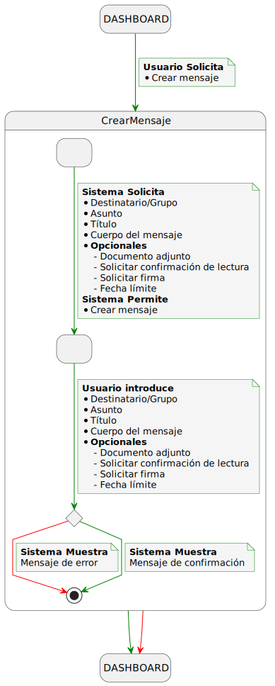
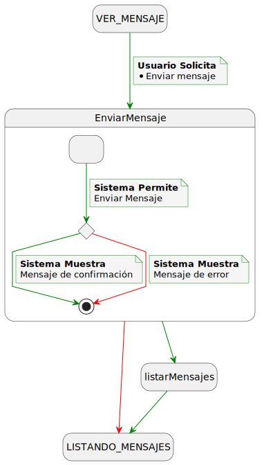
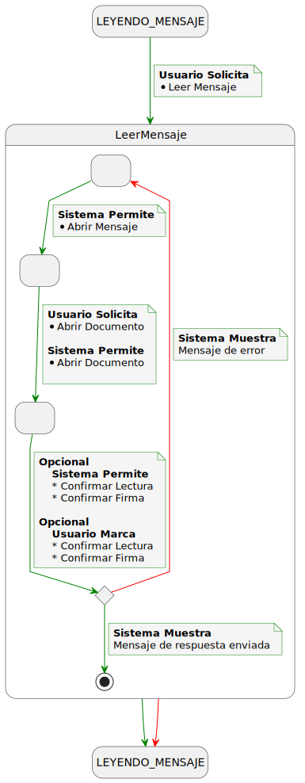
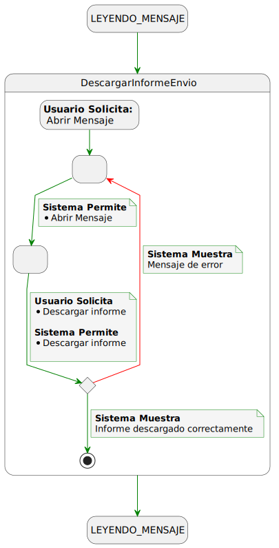
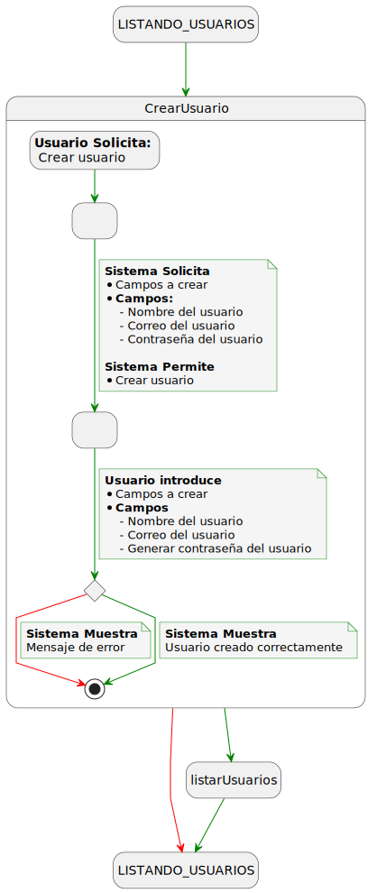
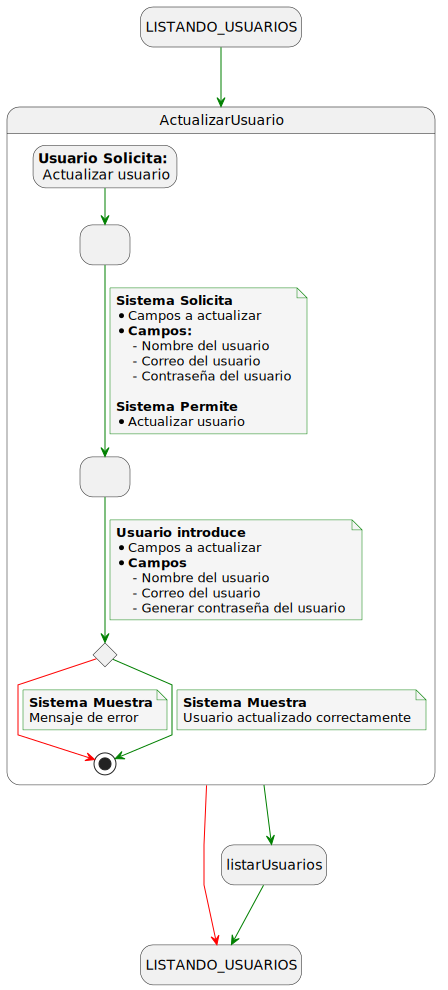
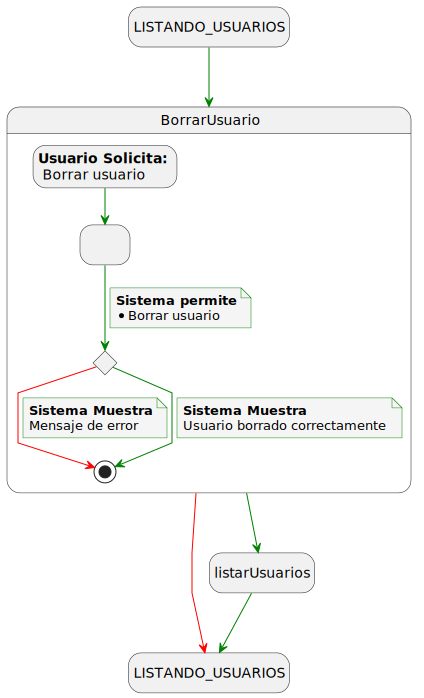
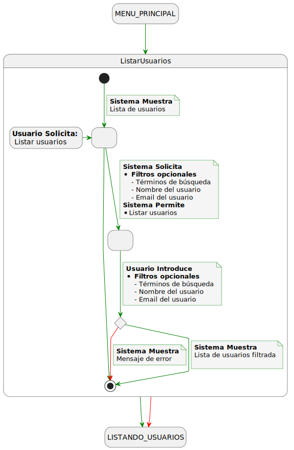
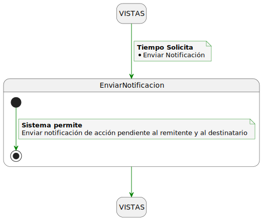

|          |
|-:|

## Detallado de Casos de Uso

## Diagrama Detallado de Manejo de Sesión

### Detallado del Login

### Detallado del Logout

## Diagrama Detallado de Grupos

### Detallado de Crear Grupo

### Detallado de Listar Grupos

### Detallado de Actualizar Grupo

### Detallado de Borrar Grupo

## Diagrama Detallado de Auditoría

### Detallado de Listar Acciones

### Detallado de Ver Acción

### Detallado de Descargar Documento de Auditoría

## Diagrama Detallado de Envío de Mensajes

### Detallado de Crear un Mensaje

### Detallado de Envío de un Mensaje

## Diagrama Detallado de Lectura y Confirmación de Documentos

## Diagrama Detallado de Descargar Informe del Envío

## Detallado de Usuarios

### Detallado de Crear Usuario

### Detallado de Actualizar Usuario

### Detallado de Borar Usuario

### Detallado de Listar Usuarios

## Detallado de Notificaciones

### Detallado de Envío de Notificaciones

---
