

|          |
| ----------------------------------------------------------------------------------------------------------------------------------------------------------------------------------------------------------------------------------------------------------------------------------------------------------------------------------------------------------------------------------------------------------------------------------------------------------------------------------------------------------------------------------------------------------------------------------------------------------------------------------------------------------------------------------------------------------------------------------------------------------------------------------------------------------------------------------------------------------------------------------------------------------------------------------------------------------------------------------------------------------------------------------------------------------------------------------------------------------------------------------------------------------------------------------------------------------------------------------------: |

## Detallado de Casos de Uso

      

## Diagrama Detallado de Manejo de Sesión

### Detallado del Login

### Detallado del Logout

## Diagrama Detallado de Abrir Menú Principal

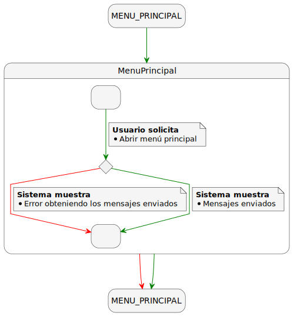

## Diagrama Detallado de Grupos

### Detallado de Crear Grupo

### Detallado de Listar Grupos

### Detallado de Actualizar Grupo

### Detallado de Borrar Grupo

## Diagrama Detallado de Auditoría

### Detallado de Listar Acciones

### Detallado de Ver Acción

### Detallado de Descargar Documento de Auditoría

## Diagrama Detallado de Envío de Mensajes

### Detallado de Crear un Mensaje

### Detallado de Actualizar un Mensaje

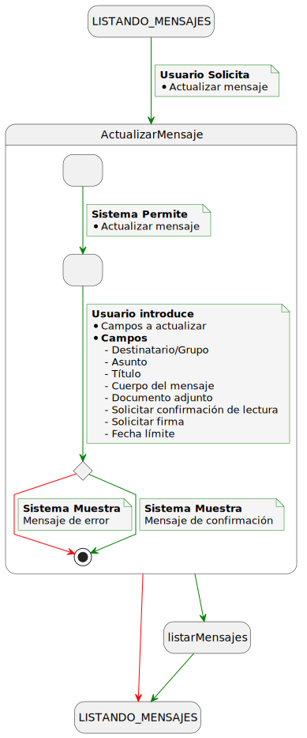

### Detallado de Envío de un Mensaje

## Detallado de Mensajes Recibidos

### Diagrama Detallado de Listar Mensajes

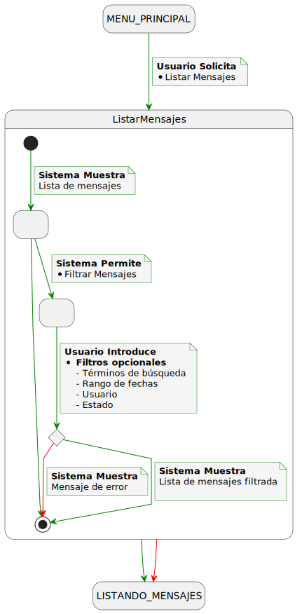

### Diagrama Detallado de Lectura y Confirmación de Documentos

## Diagrama Detallado de Descargar Informe del Envío

## Detallado de Usuarios de tipo Gestor

### Detallado de Crear Usuario de tipo Gestor

### Detallado de Actualizar Usuario de tipo Gestor

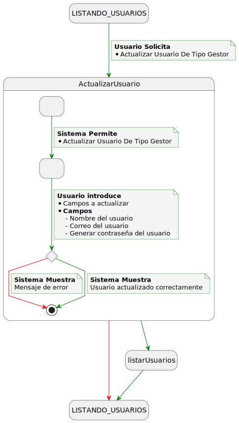

### Detallado de Borrar Usuario de tipo Gestor

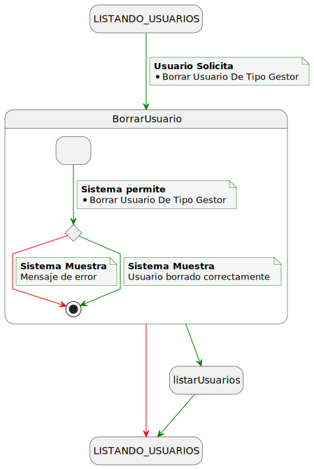

### Detallado de Listar Usuarios de tipo Gestor

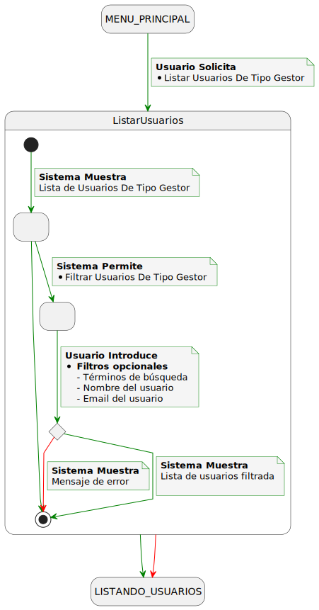

## Detallado de Usuarios de tipo Destinatario

### Detallado de Crear Usuario de tipo Destinatario

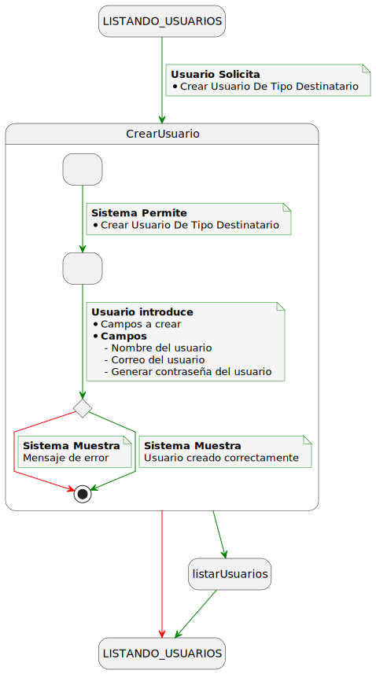

### Detallado de Actualizar Usuario de tipo Destinatario

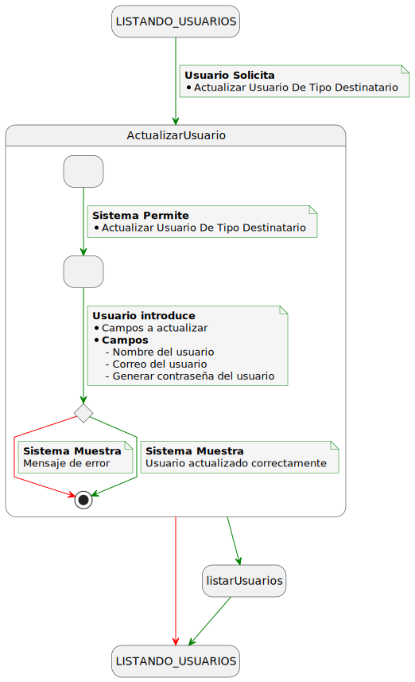

### Detallado de Borrar Usuario de tipo Destinatario

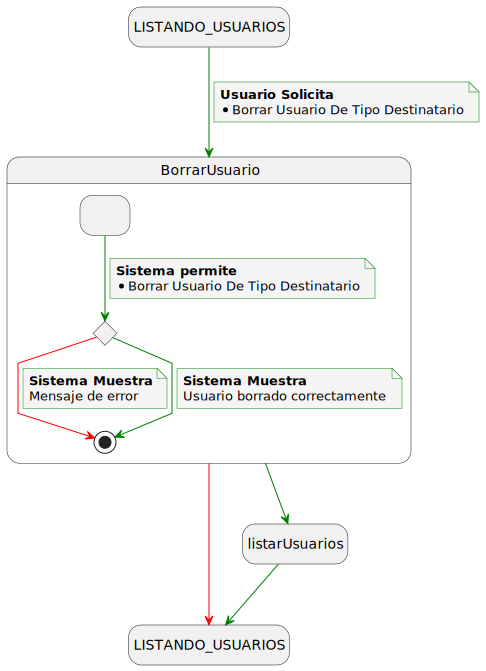

### Detallado de Listar Usuarios de tipo Destinatario

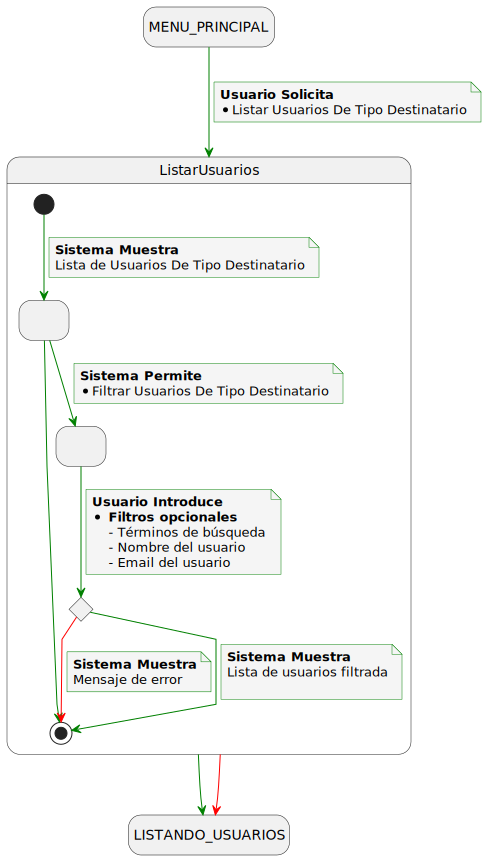

## Detallado de Notificaciones

### Detallado de Envío de Notificaciones al Remitente

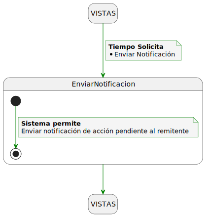

### Detallado de Envío de Notificaciones al Destinatario

## 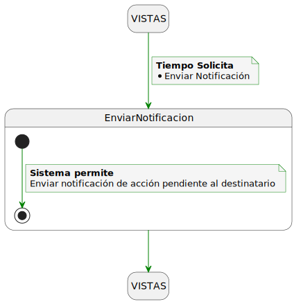

---

|          |
| ----------------------------------------------------------------------------------------------------------------------------------------------------------------------------------------------------------------------------------------------------------------------------------------------------------------------------------------------------------------------------------------------------------------------------------------------------------------------------------------------------------------------------------------------------------------------------------------------------------------------------------------------------------------------------------------------------------------------------------------------------------------------------------------------------------------------------------------------------------------------------------------------------------------------------------------------------------------------------------------------------------------------------------------------------------------------------------------------------------------------------------------------------------------------------------------------------------------------------------------: |
