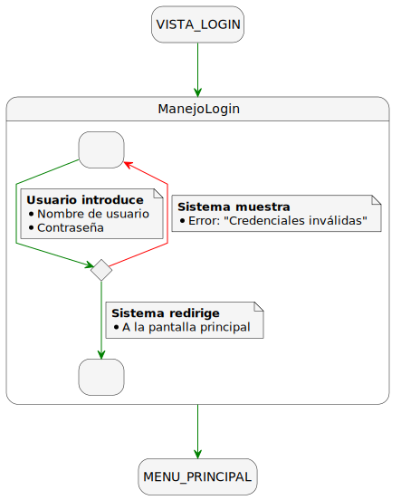
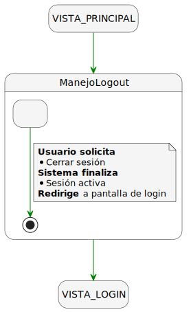
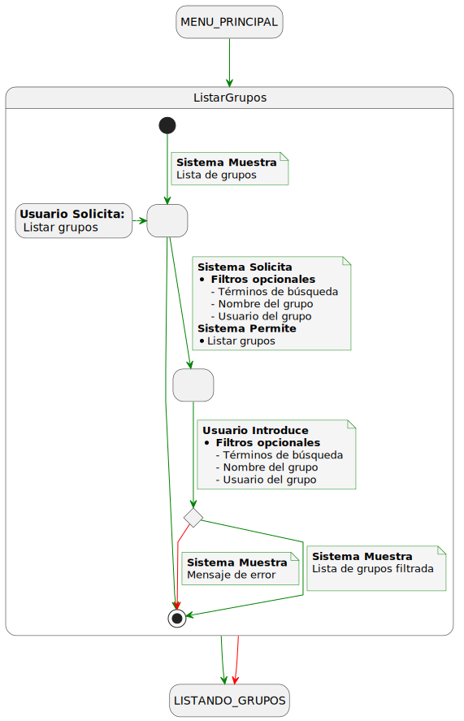
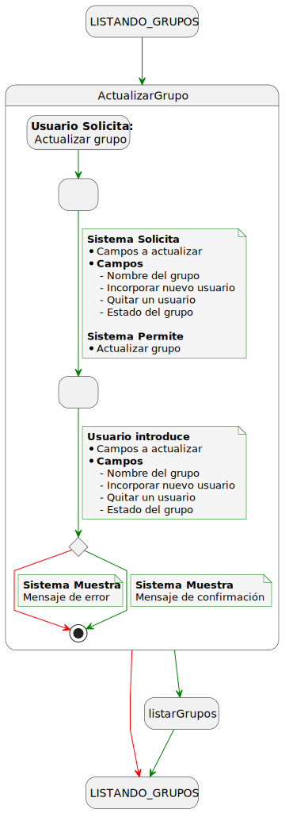
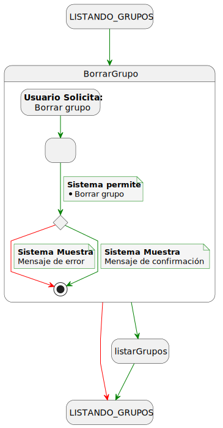
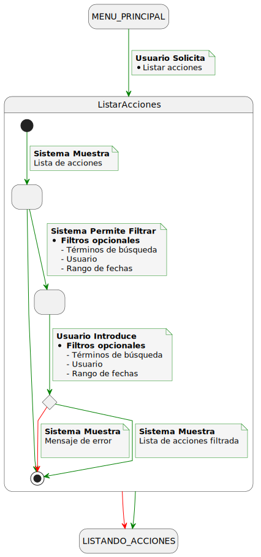
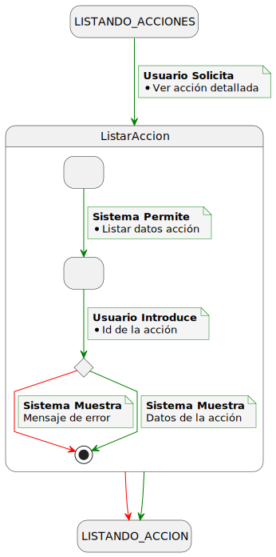
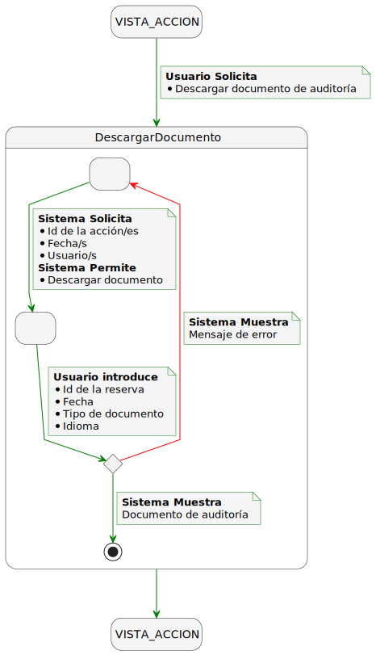

|     |
| -----------------------------------------------------------------------------------------------------------------------------------------------------------------------------------------------------------------------------------------------------------------------------------------------------------------------------------------------------------------------------------------------------------------------------------------------------------------------------------------: |

## Detallado de Casos de Uso

## Diagrama Detallado de Manejo de Sesión

### Detallado del Login

### Detallado del Logout

## Diagrama Detallado de Grupos

### Detallado de Crear Grupo

### Detallado de Listar Grupos

### Detallado de Actualizar Grupo

### Detallado de Borrar Grupo

## Diagrama Detallado de Auditoría

### Detallado de Listar Acciones

### Detallado de Ver Acción

### Detallado de Descargar Documento de Auditoría

---
