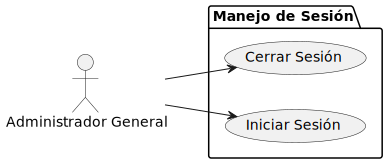
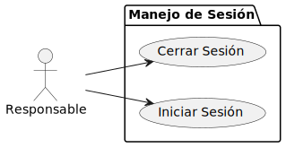
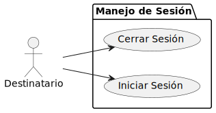

|     |
|-:|

# Diagrama Casos de Uso

## Administrador General

|                                 CRUD de Usuarios                                  |                                CRUD de Categorías                                |
| :-------------------------------------------------------------------------------: | :------------------------------------------------------------------------------: |
|  |  |

|                                Envío de Documentos                                 |                                Manejo de Sesión                                  |
| :--------------------------------------------------------------------------------: | :------------------------------------------------------------------------------: |
|  |  |

## Responsable

|                              CRUD de Destinatarios                               |                                CRUD de Categorías                                |
| :-------------------------------------------------------------------------------: | :------------------------------------------------------------------------------: |
|  |  |

|                                Envío de Documentos                                 |                                Manejo de Sesión                                  |
| :--------------------------------------------------------------------------------: | :------------------------------------------------------------------------------: |
|  |  |

|                     Visualización y Confirmación de Documentos                    |
| :------------------------------------------------------------------------------: |
|  |

---

## Destinatario

|                          Visualización y Confirmación de Documentos                        |                                Manejo de Sesión                                  |
| :---------------------------------------------------------------------------------------: | :------------------------------------------------------------------------------: |
|  |  |

## Tiempo

|                          Recordatorios                        |
| :----------------------------------------------------------: |
|  |

---
