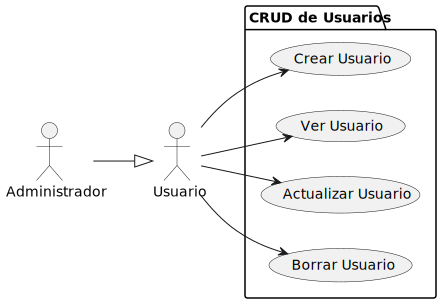
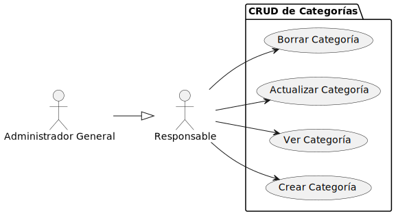
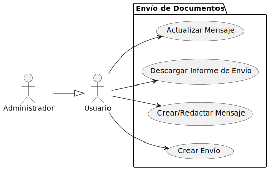
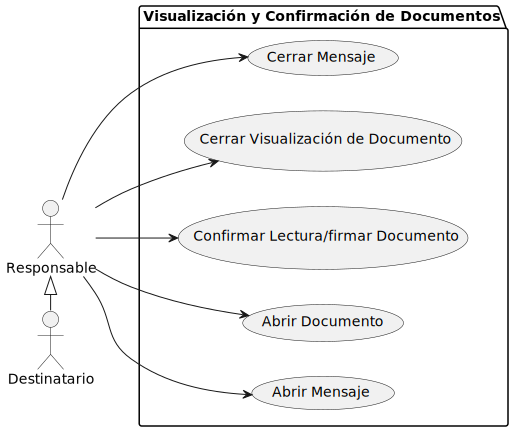
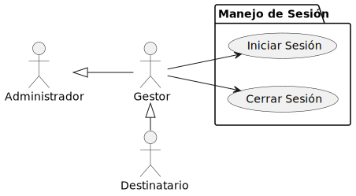
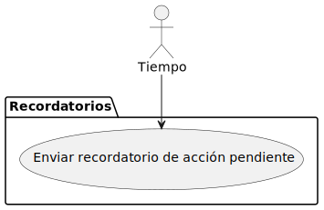

|     |
|-:|

# Diagrama Casos de Uso

## CRUD de Usuarios

## CRUD de Categorías

## Envío de Documentos

## Visualización y Confirmación de Documentos

## Manejo de sesión

## Manejo de notificaciones

