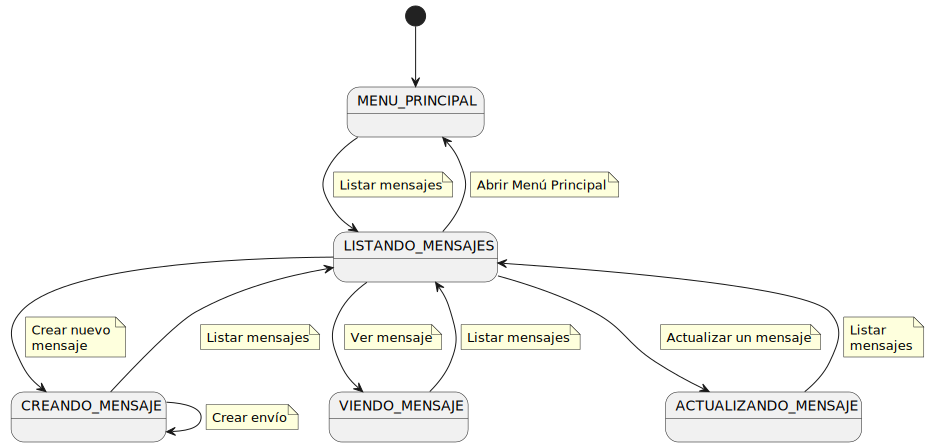

|          |
| ----------------------------------------------------------------------------------------------------------------------------------------------------------------------------------------------------------------------------------------------------------------------------------------------------------------------------------------------------------------------------------------------------------------------------------------------------------------------------------------------------------------------------------------------------------------------------------------------------------------------------------------------------------------------------------------------------------------------------------------------------------------------------------------------------------------------------------------------------------------------------------------------------------------------------------------------------------------------------------------------------------------------------------------------------------------------------------------------------------------------------------------------------------------------------------------------------------------------------------------: |

# Diagramas de Contexto de los Actores

## Administrador

#### Manejo de Mensajes

#### Manejo de Grupos

#### Manejo de Usuarios

#### Manejo de Acciones

---

## Gestor

#### Manejo de Mensajes

#### Manejo de Grupos

#### Manejo de Usuarios

## Destinatario

---
