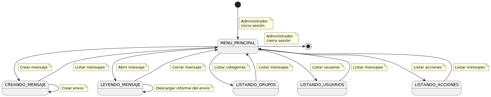
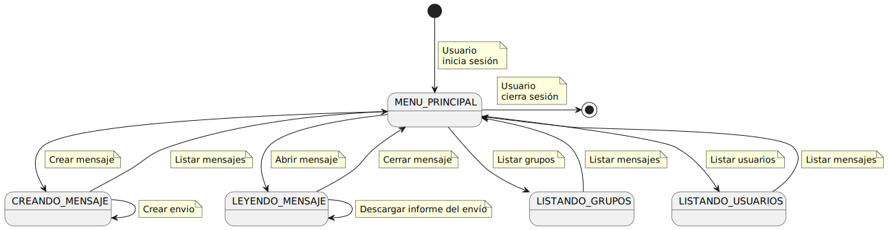
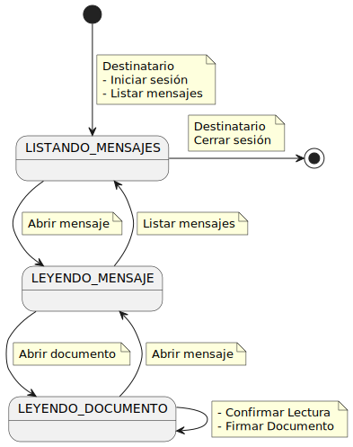
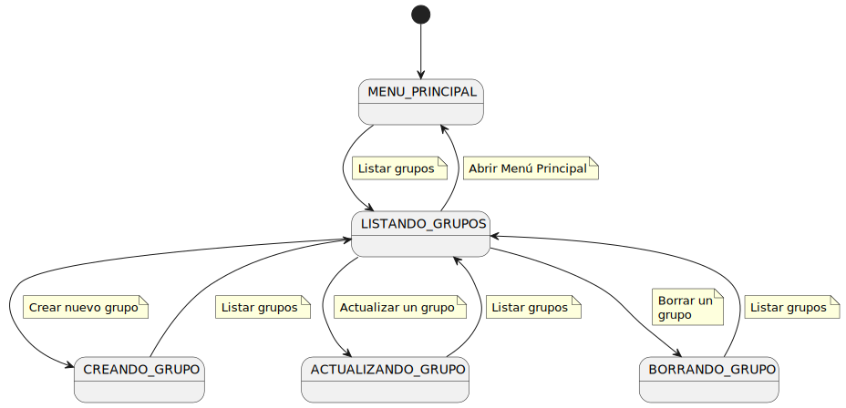
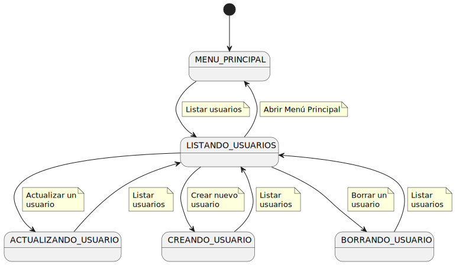
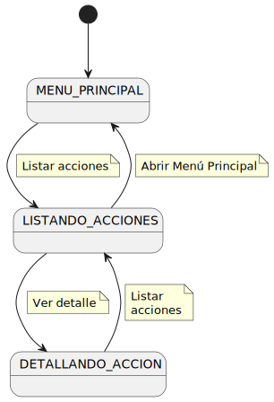

|     |
|-:|

# Diagramas de Contexto de los Actores

## Diagrama de Contexto de Administrador

## Diagrama de Contexto de Usuario

## Diagrama de Contexto Destinatario

----

# Diagramas de contexto de los casos de uso

## Diagrama de contexto de Manejo de Grupos

## Diagrama de contexto de Manejo de Usuarios

## Diagrama de contexto de Manejo de Acciones

