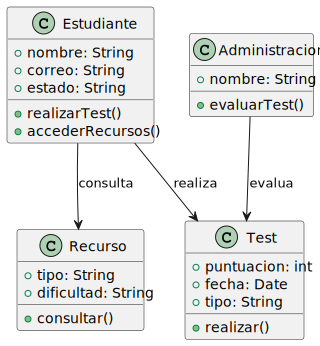

# Modelo del dominio

Estos son los diagramas de aproximacion al modelo de dominio del proyecto.

## Diagramas de Clases

[codigo](modelo_del_dominio/test/modelos_uml/DagramaDeClases.puml)

[codigo](modelo_del_dominio/test/diagramas/Actividades.puml)