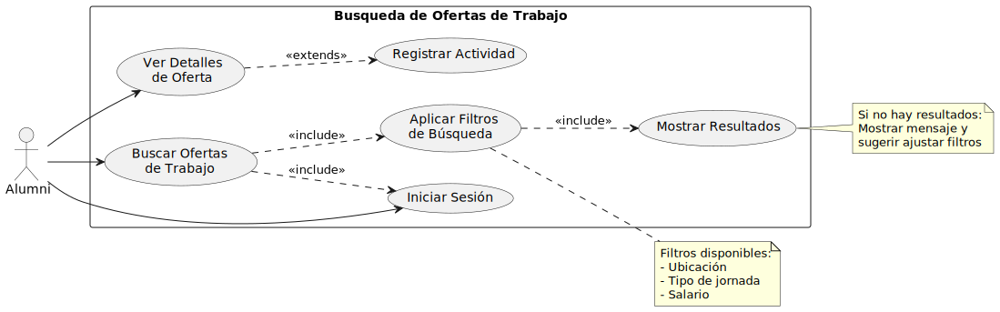
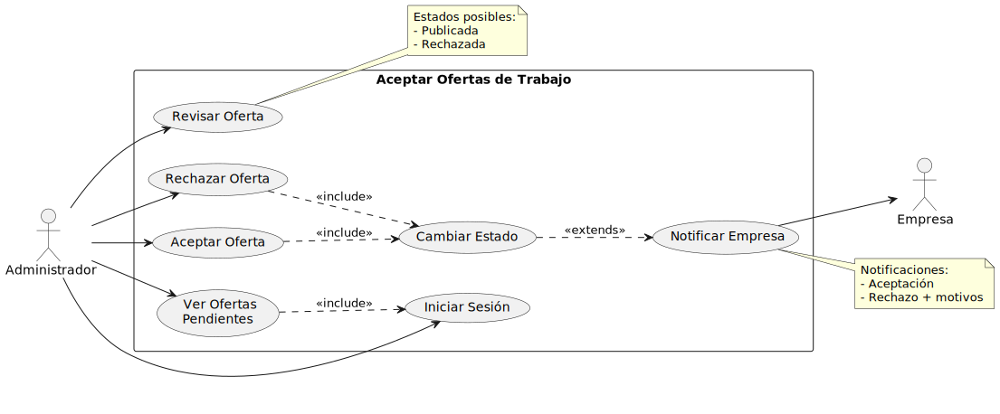
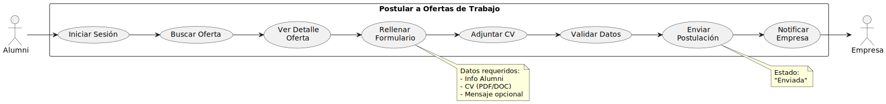
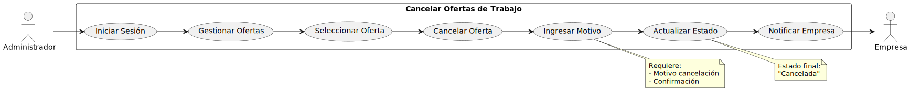
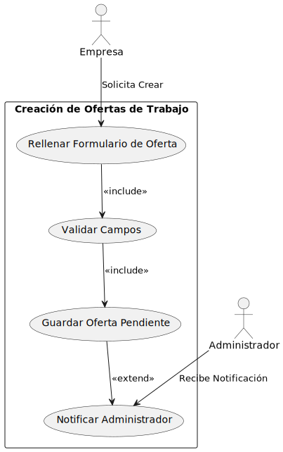
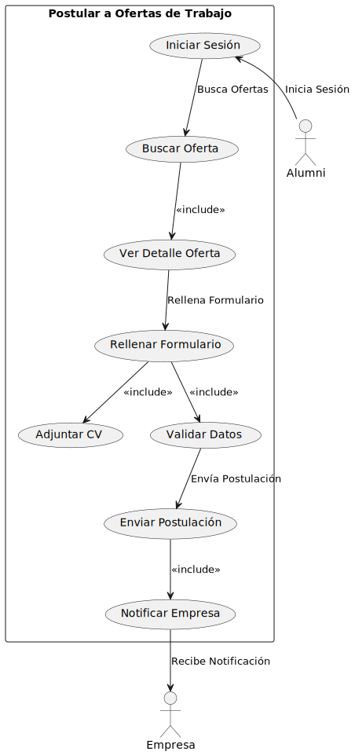
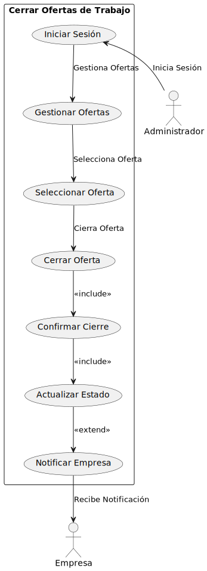

# Identificación y Priorización de Actores y Casos de Uso

## 1. Identificar Actores y Casos de Uso

### Actores
- **Administrador**: Actor clave para la gestión y validación de ofertas de trabajo.
- **Alumni**: Usuario que interactúa con la plataforma para buscar y postular a ofertas.
- **Empresa**: Protagonista en la creación, modificación y cierre de ofertas.

### Casos de Uso
1. **Crear oferta de trabajo** *(Empresa)*: La empresa solicita registrar una nueva oferta en el sistema.
2. **Buscar oferta de trabajo** *(Alumni)*: Los alumni pueden buscar ofertas que coincidan con sus intereses.
3. **Aceptar oferta de trabajo** *(Administrador)*: El administrador valida las ofertas creadas para que sean públicas.
4. **Postular para la oferta de trabajo** *(Alumni)*: Los alumni pueden enviar su solicitud para una oferta de trabajo específica.
5. **Cerrar oferta de trabajo** *(Administrador, Empresa)*: Una oferta se finaliza porque ya no está disponible.
6. **Cancelar oferta de trabajo** *(Administrador)*: El administrador cancela una oferta de trabajo.

---

## 2. Priorizar Casos de Uso

La prioridad debe basarse en su importancia estratégica, valor para el cliente, complejidad, riesgo... En este caso, se priorizan los casos de uso según su relevancia para el funcionamiento básico del sistema.

1. **Crear oferta de trabajo** *(Alta prioridad)*  
   Es el primer paso en el flujo de trabajo; sin ofertas, el sistema no tiene utilidad.

2. **Buscar oferta de trabajo** *(Alta prioridad)*  
   Es la función principal para los alumni y uno de los puntos más críticos de la plataforma.

3. **Postular para la oferta de trabajo** *(Media/Alta prioridad)*  
   Una vez que las ofertas están disponibles, esta funcionalidad permite que los alumni interactúen activamente con el sistema.

4. **Aceptar oferta de trabajo** *(Media prioridad)*  
   La validación de ofertas es importante, pero depende del flujo de creación de ofertas.

5. **Cerrar oferta de trabajo** *(Media prioridad)*  
   Su importancia varía dependiendo de la actividad en la plataforma.

6. **Cancelar oferta de trabajo** *(Baja prioridad)*  
   Este caso de uso se activa en escenarios específicos, pero no es central en el funcionamiento básico del sistema.

## 3. Detallar casos de uso

### Crear oferta de trabajo

- **Actor**: Empresa
- **Descripción**: Empresa crea una nueva oferta laboral pendiente de validación

### Buscar oferta de trabajo

- **Actor**: Alumni
- **Descripción**: Alumni busca y filtra ofertas laborales disponibles

### Aceptar oferta de trabajo

- **Actor**: Administrador
- **Descripción**: Administrador revisa y aprueba ofertas pendientes

### Postular a oferta de trabajo

- **Actor**: Alumni
- **Descripción**: Alumni postula a una oferta adjuntando CV y datos

### Cerrar oferta de trabajo

- **Actor**: Administrador
- **Descripción**: Administrador cierra una oferta activa 

### Cancelar oferta de trabajo

- **Actor**: Administrador
- **Descripción**: Administrador cancela una oferta por incumplimiento

# Diagramas de Contexto

Este documento contiene los diagramas de contexto de los casos de uso para el sistema de gestión de ofertas de trabajo. Cada diagrama describe las interacciones clave entre los actores y los casos de uso involucrados.

## Diagramas Generados

### 1. Crear Oferta de Trabajo

Este diagrama muestra cómo la **Empresa** solicita la creación de una oferta, la cual es validada y guardada como pendiente. Luego, el **Administrador** es notificado para revisarla.

### 2. Buscar Oferta de Trabajo

El **Alumni** puede realizar búsquedas aplicando filtros y viendo los detalles de las ofertas. Las actividades también son registradas automáticamente.

### 3. Aceptar Oferta de Trabajo

El **Administrador** revisa las ofertas pendientes, puede aceptarlas o rechazarlas, y notifica a la **Empresa** sobre el resultado.

### 4. Postular a Oferta de Trabajo

El **Alumni** inicia sesión, busca una oferta, rellena un formulario, adjunta su CV y envía su postulación. La **Empresa** es notificada tras el envío.

### 5. Cerrar Oferta de Trabajo

El **Administrador** puede cerrar ofertas activas tras gestionarlas y confirmar el cierre. La **Empresa** es notificada de este estado final.

### 6. Cancelar Oferta de Trabajo

El **Administrador** tiene la opción de cancelar una oferta, ingresando un motivo, y notificando a la **Empresa** sobre la cancelación.

