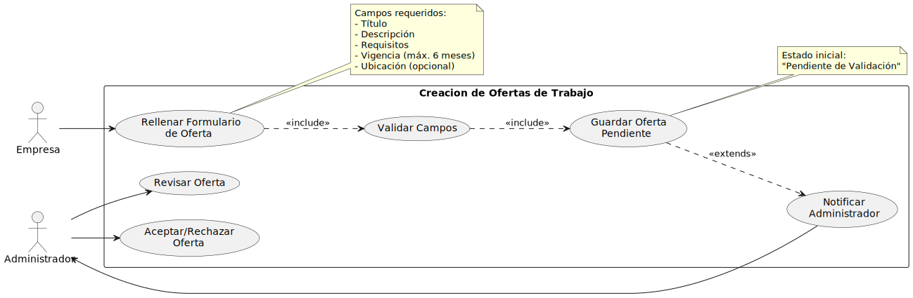
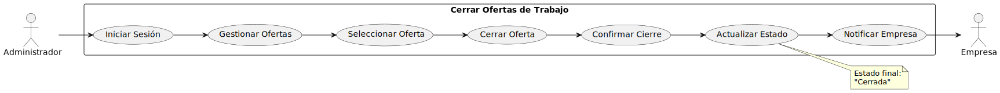

# Identificación y Priorización de Actores y Casos de Uso

## 1. Identificar Actores y Casos de Uso

### Actores
- **Administrador**: Actor clave para la gestión y validación de ofertas de trabajo.
- **Alumni**: Usuario que interactúa con la plataforma para buscar y postular a ofertas.
- **Empresa**: Protagonista en la creación, modificación y cierre de ofertas.

### Casos de Uso
1. **Crear oferta de trabajo** *(Empresa)*: La empresa solicita registrar una nueva oferta en el sistema.
2. **Buscar oferta de trabajo** *(Alumni)*: Los alumni pueden buscar ofertas que coincidan con sus intereses.
3. **Aceptar oferta de trabajo** *(Administrador)*: El administrador valida las ofertas creadas para que sean públicas.
4. **Postular para la oferta de trabajo** *(Alumni)*: Los alumni pueden enviar su solicitud para una oferta de trabajo específica.
5. **Cerrar oferta de trabajo** *(Administrador, Empresa)*: Una oferta se finaliza porque ya no está disponible.
6. **Cancelar oferta de trabajo** *(Administrador)*: El administrador cancela una oferta de trabajo.

---

## 2. Priorizar Casos de Uso

La prioridad debe basarse en su importancia estratégica, valor para el cliente, complejidad, riesgo... En este caso, se priorizan los casos de uso según su relevancia para el funcionamiento básico del sistema.

1. **Crear oferta de trabajo** *(Alta prioridad)*  
   Es el primer paso en el flujo de trabajo; sin ofertas, el sistema no tiene utilidad.

2. **Buscar oferta de trabajo** *(Alta prioridad)*  
   Es la función principal para los alumni y uno de los puntos más críticos de la plataforma.

3. **Postular para la oferta de trabajo** *(Media/Alta prioridad)*  
   Una vez que las ofertas están disponibles, esta funcionalidad permite que los alumni interactúen activamente con el sistema.

4. **Aceptar oferta de trabajo** *(Media prioridad)*  
   La validación de ofertas es importante, pero depende del flujo de creación de ofertas.

5. **Cerrar oferta de trabajo** *(Media prioridad)*  
   Su importancia varía dependiendo de la actividad en la plataforma.

6. **Cancelar oferta de trabajo** *(Baja prioridad)*  
   Este caso de uso se activa en escenarios específicos, pero no es central en el funcionamiento básico del sistema.

## 3. Detallar casos de uso

### Crear oferta de trabajo

- **Actor**: Empresa
- **Descripción**: Empresa crea una nueva oferta laboral pendiente de validación

### Buscar oferta de trabajo

- **Actor**: Alumni
- **Descripción**: Alumni busca y filtra ofertas laborales disponibles

### Aceptar oferta de trabajo

- **Actor**: Administrador
- **Descripción**: Administrador revisa y aprueba ofertas pendientes

### Postular a oferta de trabajo

- **Actor**: Alumni
- **Descripción**: Alumni postula a una oferta adjuntando CV y datos

### Cerrar oferta de trabajo

- **Actor**: Administrador
- **Descripción**: Administrador cierra una oferta activa

### Cancelar oferta de trabajo

- **Actor**: Administrador
- **Descripción**: Administrador cancela una oferta por incumplimiento

## **Prototipar Casos de Uso**

---

### **Crear Oferta de Trabajo**

1. **La empresa inicia sesión en la plataforma**

2. **Accede a la sección "Crear oferta de trabajo"**
   - Un botón redirige al formulario correspondiente.

3. **Llena los campos requeridos del formulario, que incluyen:**
   - Título de la oferta.
   - Descripción.
   - Requisitos.
   - Duración o vigencia de la oferta.
   - Ubicación (opcional).

   Una vez completado, se presiona el botón **"Guardar"**.

4. **El sistema valida que todos los campos obligatorios estén completos.**

5. **El sistema guarda la oferta como "Pendiente de Validación".**
   - La oferta se almacena en una base de datos.
   - Un botón **"Pendiente de Validación"** estará habilitado para acceder a estas ofertas.

6. **El administrador recibe una notificación para revisar la oferta.**
   - El sistema notifica que hay una oferta pendiente y el administrador puede acceder desde el botón correspondiente.

---

### **Buscar Oferta de Trabajo**

1. **El alumni inicia sesión en la plataforma**

2. **Accede a la sección "Buscar ofertas de trabajo".**
   - Un botón habilitado en el perfil del alumni redirige a esta sección, mostrando todas las ofertas almacenadas en la base de datos.

3. **Introduce criterios de búsqueda, como:**
   - Ubicación.
   - Tipo de jornada.
   - Salario.

4. **El sistema procesa la consulta y muestra una lista de ofertas que cumplen con los criterios.**

5. **El alumni selecciona una oferta para ver más detalles.**
   - Al seleccionar una oferta, se muestra la descripción completa.

---

### **Aceptar Oferta de Trabajo**

1. **El administrador inicia sesión en la plataforma**

2. **Accede a la sección "Ofertas Pendientes de Validación".**
   - Desde su interfaz, un botón redirige al apartado de ofertas pendientes.

3. **Visualiza una lista de ofertas con estado "Pendiente de Validación".**

4. **Selecciona una oferta para revisarla en detalle.**

5. **Valida o rechaza la oferta:**
   - Si la oferta es válida, presiona el botón **"Aceptar"**, y la oferta se publica para los alumni.
   - Si la oferta no es válida, presiona el botón **"No validar"**, y la oferta se elimina del sistema.

6. **El sistema notifica a la empresa que su oferta ha sido aceptada.**

---

### **Postular para la Oferta de Trabajo**

1. **El alumni inicia sesión en la plataforma**

2. **Busca y selecciona una oferta publicada.**
   - Puede buscar ofertas mediante palabras clave o explorar la lista de ofertas publicadas.

3. **Accede al detalle de la oferta y presiona el botón "Postular".**
   - El sistema muestra un formulario con los siguientes campos:
      - **Información del alumni.**
      - **Adjuntar currículum vitae** (formatos permitidos: PDF, DOC, DOCX).
      - Campo opcional para agregar un mensaje personalizado a la empresa.

4. **El sistema valida que toda la información requerida esté completa.**

5. **El sistema registra la postulación y notifica a la empresa.**
   - La postulación queda registrada en una base de datos accesible para la empresa.
   - La empresa recibe una notificación sobre la nueva solicitud.

6. **El alumni recibe una confirmación.**
   - El sistema confirma que la postulación se ha enviado correctamente.
   - Además, se envía un correo electrónico con la misma información.

---

### **Cerrar Oferta de Trabajo**

1. **El administrador inicia sesión en la plataforma**

2. **Accede a la sección "Gestión de Ofertas".**
   - Desde esta sección, visualiza una lista de ofertas con estado **"Publicada"**.

3. **Selecciona una oferta y presiona el botón "Cerrar Oferta".**
   - Al cerrar la oferta, esta deja de estar visible para los alumni.
   - El sistema actualiza el estado de la oferta como **"Cerrada"**.

4. **El sistema notifica a la empresa.**
   - La empresa recibe una notificación interna y un correo electrónico informando que la oferta ha sido cerrada.

---