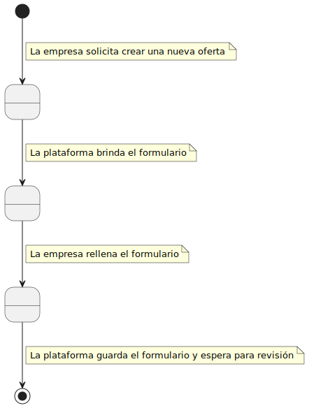
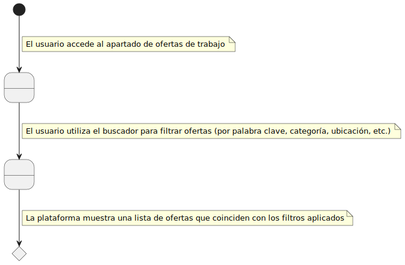
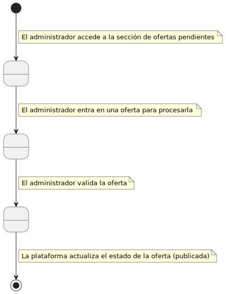
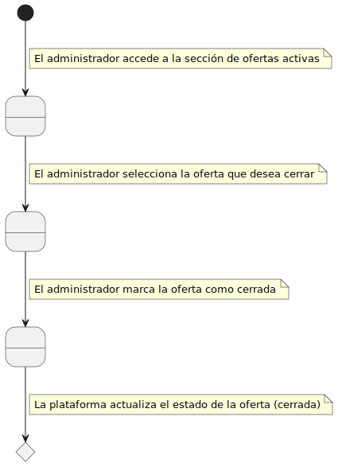
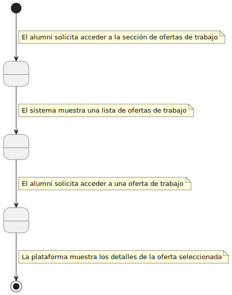
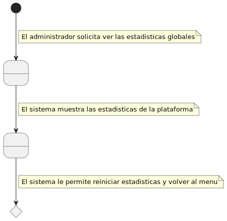

# Detallar Casos de Uso
### 1. **Crear oferta de trabajo**

### 2. **Buscar oferta de trabajo**

### 3. **Aceptar oferta de trabajo**

### 4. **Postular para la oferta de trabajo** 

### 5. **Cerrar oferta de trabajo**

### 6. **Cancelar oferta de trabajo**

### 7. **Ver ofertas de trabajo**

### 8. **Ver estadísticas**

