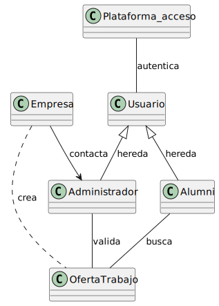
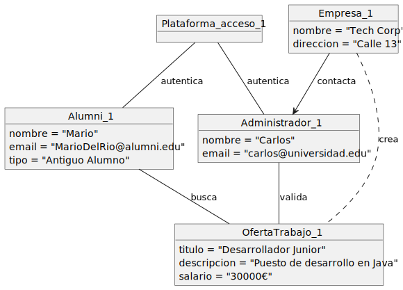
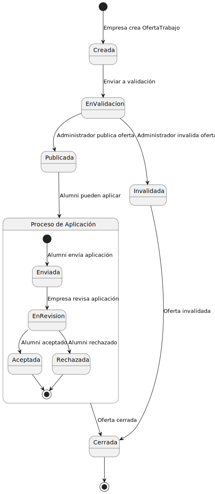

## 📊 Diagramas del modelo del dominio

### 🔄 Diagrama de Clases
Representa la estructura y relaciones entre las diferentes clases del sistema.

### 📦 Diagrama de Objetos
Muestra una instantánea del sistema en tiempo de ejecución.

### ⚡ Diagrama de Estados
Ilustra los diferentes estados y transiciones de los elementos del sistema.

